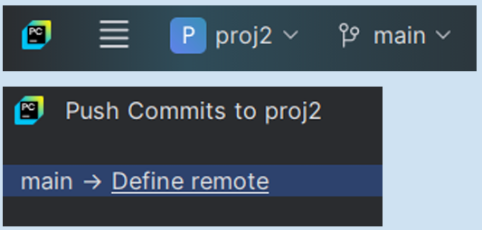

# Lesson 02, Week 01, Exercise 01

---

### 1 Skapa projekt och synka med GitHub

---

1  
Skapa ett nytt Python-projekt, med ett git-repository.  
Skapa en fil med namnet "main.py".   
När man kör filen ska programmet skriva ut följande på terminalen, 
fast byt ut "Ditt Namn" mot ditt namn:  
"Hello world"  
"This program was made by Ditt Namn"  

2  
Lägg till alla ändringar till en commit. (ändringar = changes)  

3  
Öppna inställningarna:  
File → Settings → Version Control → GitHub.  
Lägg till ditt GitHub-konto.  

4  
Klicka på main-branch-ikonen.  
Välj alternativet "Push" och "Define remote".  
 

 

5  
Skapa ett repository på GitHub.  
Se till att det är public.  
Kopiera URL till repot (webbläsarens adressfält) och skriv in i 
fältet "Define remote".  
Nu kan du synka ditt lokala projekt med remote som är GitHub.  
Det gör det lätt att dela din kod mellan olika datorer.  

_Om detta strular:  
öppna terminalen från din editor och skriv:  
"git push"  
för att använda git direkt, utan editorn som mellanhand.  
Om något går fel kommer git tipsa dig om vad du ska göra._  

---

Create a new Python project.

Create a file called "main.py"

When running a file it shall produce:  
Hello world  
This program was made by "your name"  

Add all changes to a commit  

Add your GitHub account  

Sync to your repo on GitHub  

---

Student == gnoff

---

Copyright 2025-2026 gnoff

Licensed under the Apache License, Version 2.0 (the "License");  
you may not use this file except in compliance with the License.  
You may obtain a copy of the License at  

     http://www.apache.org/licenses/LICENSE-2.0

Unless required by applicable law or agreed to in writing, software  
distributed under the License is distributed on an "AS IS" BASIS,  
WITHOUT WARRANTIES OR CONDITIONS OF ANY KIND, either express or 
implied.  
See the License for the specific language governing permissions and  
limitations under the License.

---
