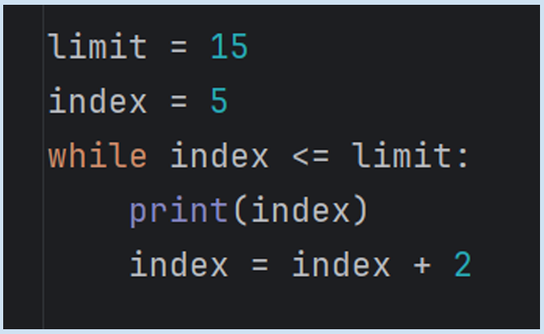
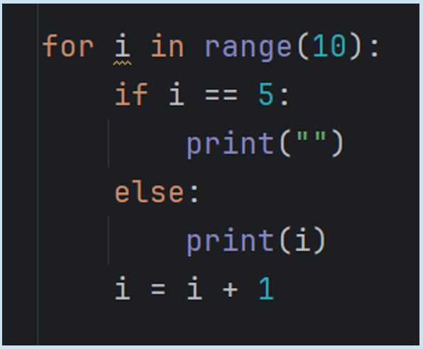
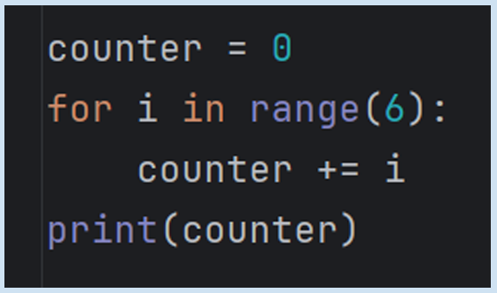
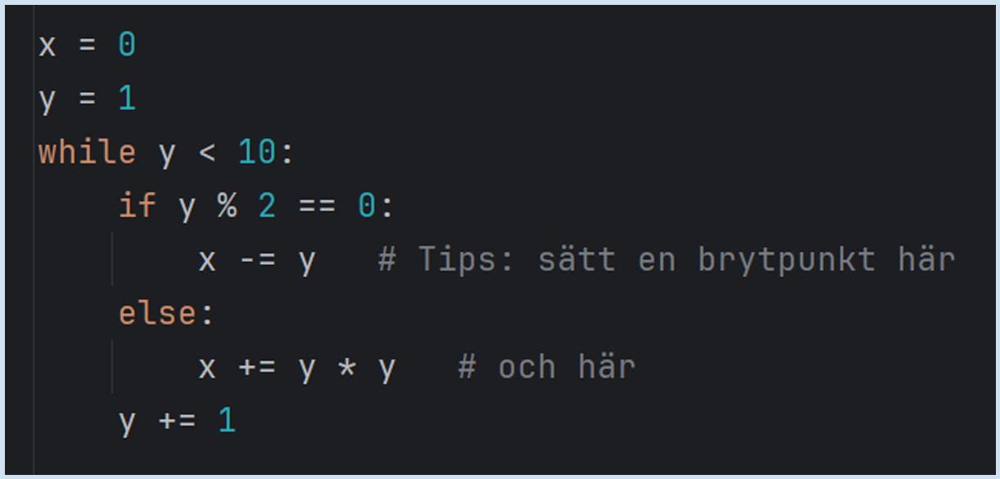
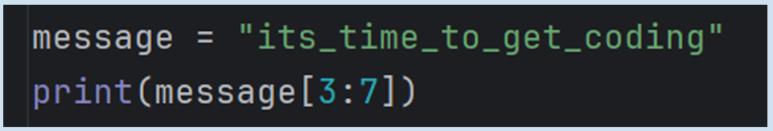

# Lesson 02, Week 03, Exercise 01  

---

## 1 Diskutera i grupp

---

See [main.py](main.py) in this folder for TAP HT 25D week 3, 
exercise 1, assignment.  

No reference in "og_2024" folder for OG 2024 (TAP HT 24D) work.  
This is because the first assignment was only discussed, not saved 
as code.  

Other files are for when working "in between the two courses" on my 
own to get back into it and learn things.  

---

### Assignment Information  

Skriv ner vad du tror kommer skrivas ut.  
Skriv sedan in koden i din IDE, exakt som den står, 
och kör den.  

---

### 1.1 - Vad skrivs ut?  

    limit = 15
    index = 5
    
    while index <= limit:
        print(index)
        index = index + 2

 

---

### 1.2 - Vad skrivs ut?  

    for i in range (10):
        if i == 5:
            print('')
        else:
            print(i)
        i = i + 1

 

---

### 1.3 - Vad blir summan?  

Skriv ner din bästa gissning _innan_ du kör koden.  

    counter = 0
    for i in range (6):
        counter += i
    print(counter)

 

---

### 1.4 - Vad skrivs ut?  

För att förstå koden kan du sätta ut brytpunkter och 
köra med debugging.  
Det kan också underlätta att skriva samtidigt med papper 
och penna.  

    x = 0
    y = 1
    while y < 10:
        if y % 2 == 0:
            x -= y # Tips: sätt en brytpunkt här
        else:
            x += y * y # och här
        y += 1

 

---

### 1.5 - Vad skrivs ut?  

Kan du göra om koden så att den skriver ut "time" i stället?   

    message = 'its_time_to_get_coding'
    print(message[3:7])

 

---

### 1.6 - Vad skrivs ut?  

Kan du flytta linjen ett steg åt höger?  

    for y in range(1, 7):
        s = ''
        for x in range(1, 9):
            if x == y:
                s += '#'
            else:
                s += '.'
        print(s)

---

Student == **_gnoff_**  

---

Copyright 2025-2026 gnoff

Licensed under the Apache License, Version 2.0 (the "License");  
you may not use this file except in compliance with the License.  
You may obtain a copy of the License at  

     http://www.apache.org/licenses/LICENSE-2.0

Unless required by applicable law or agreed to in writing, software  
distributed under the License is distributed on an "AS IS" BASIS,  
WITHOUT WARRANTIES OR CONDITIONS OF ANY KIND, either express or 
implied.  
See the License for the specific language governing permissions and  
limitations under the License.

---
