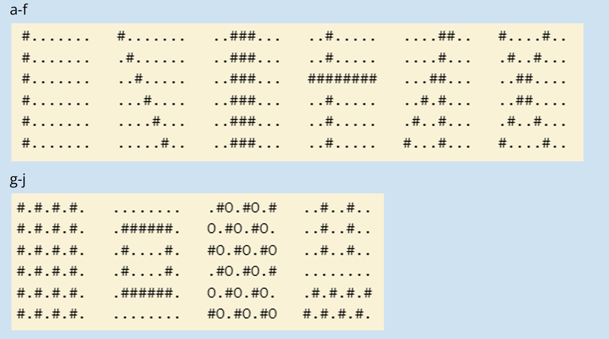

# Lesson 02, Week 03, Exercise 04  

---

## 4 Figurer med loopar  

---

See [main.py](main.py) in this folder for TAP HT 25D week 3, 
exercise 2, assignment.  

Reference to files  

[e4_different_solution.py](./og_2024/e4_different_solution.py)  
[e4_images_with_loops.py](./og_2024/e4_images_with_loops.py)  
[img_def.py](./og_2024/img_def.py)  

in "og_2024" folder for OG 2024 (TAP HT 24D) work.  

Other files are for when working "in between the two courses" on my 
own to get back into it and learn things.  

---

### Assignment Information  

---

Skriv in följande kod och modifiera den, 
så att den skriver ut figurerna a-j en i taget.  

    for y in range(1, 7):
        s = ""
        for x in range(1, 9):
            if x == y:
                s += "#"
            else:
                s += "."
        print(s)

---

---

Student == **_gnoff_**  

---

Copyright 2025-2026 gnoff

Licensed under the Apache License, Version 2.0 (the "License");  
you may not use this file except in compliance with the License.  
You may obtain a copy of the License at  

     http://www.apache.org/licenses/LICENSE-2.0

Unless required by applicable law or agreed to in writing, software  
distributed under the License is distributed on an "AS IS" BASIS,  
WITHOUT WARRANTIES OR CONDITIONS OF ANY KIND, either express or 
implied.  
See the License for the specific language governing permissions and  
limitations under the License.

---
